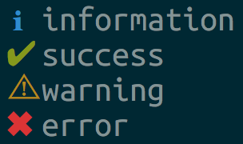
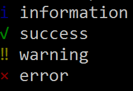

# go-log-symbols

> Colored symbols for various log levels for go.
Ported from [https://github.com/sindresorhus/log-symbols](https://github.com/sindresorhus/log-symbols)

### Mac/Linux


### Windows



## Install

```sh
$ go get -u github.com/prabirshrestha/go-log-symbols
```

## Usage

```go
package main

import (
	"fmt"
	"github.com/prabirshrestha/go-log-symbols"
)

func main() {
	fmt.Println(logSymbols.Info(), "information")
	fmt.Println(logSymbols.Success(), "success")
	fmt.Println(logSymbols.Warning(), "warning")
	fmt.Println(logSymbols.Error(), "error")
}
```

## Credits

[https://github.com/sindresorhus/log-symbols](https://github.com/sindresorhus/log-symbols)

## License

MIT